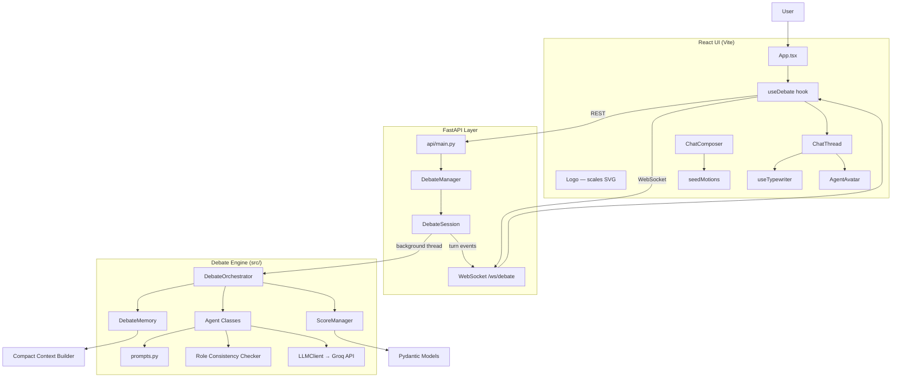

# ArgueBot: Multi-Agent Debate System

A four-agent autonomous debate system built for live university presentations. ArgueBot accepts any user-supplied debate motion, runs structured multi-round debates, scores both sides in real time, and delivers a final verdict.

## Overview

ArgueBot orchestrates four distinct AI agents:

| Agent | Role |
|-------|------|
| **Proponent** | Argues in favor of the motion |
| **Opponent** | Argues against the motion |
| **Moderator** | Enforces format, manages turns, remains neutral |
| **Scoring Judge** | Evaluates argument quality and delivers verdicts |

Unlike free-form multi-agent chat, ArgueBot uses a **central orchestrator** with deterministic turn ordering, separate system prompts, compact context management, and programmatic score validation.

## Architecture



### Layer responsibilities

| Layer | Responsibility |
|-------|----------------|
| **React UI** | Light chat-style interface — motion input, live transcript, typewriter animation, animal avatars, header score, verdict, export |
| **FastAPI** | REST endpoints for start/stop/demo/export; WebSocket streams per-debate state updates |
| **DebateManager** | In-memory session registry; runs each debate in a background thread |
| **DebateOrchestrator** | Deterministic turn plan, agent dispatch, judge scoring checkpoints, final verdict |
| **DebateMemory** | Compact per-turn context (summaries, opponent latest, claims, judge feedback) |
| **Agents + Role checks** | Per-agent generation with pattern-based persona-collapse detection and retry |
| **ScoreManager** | Programmatic rubric math — never trusts LLM arithmetic |
| **LLMClient** | Groq API wrapper with rate-limit throttling, retries, structured JSON parsing |

### Real-time data flow

1. User submits a motion via `ChatComposer` (or picks an academic seed topic).
2. `POST /api/debates/start` creates a `DebateSession` and starts the orchestrator in a background thread.
3. Frontend opens `WebSocket /ws/debate/{id}` and receives `update` events after each turn.
4. `useDebate` drives the UI — typewriter reveal, typing indicator (via `turnPlan`), live header score.
5. On completion, the final verdict and export links appear inline in the chat thread.

## Features

- Autonomous 6–10 round structured debates
- Four distinct agent personas with role-consistency enforcement
- **Chat-style UI** with turn-by-turn typewriter animation and typing indicators
- **Animal avatars** — Twemoji pictograms per agent (Duck, Tiger, Fish, Giraffe) plus a Chicken avatar for user-submitted motions
- Live score display in the header (cumulative proponent vs. opponent)
- **Academic seed motions** — six pre-loaded university debate topics for quick demos
- **Animated scales logo** — compact monochrome SVG in the header and welcome screen; beam rocks faster during live debates
- Weighted 100-point scoring rubric with programmatic validation
- Automatic retry on severe persona collapse
- Failure analysis with violation logging (backend)
- Demo Mode with prerecorded sample debate (no API key required)
- Export transcript (Markdown) and full debate record (JSON)
- Optional stress-test mode for role-consistency validation
- **Team login** — four hardcoded fruit accounts; each gets **2 live debate tests** (demo mode unlimited)

## Team access

Live debates use the shared Groq API key, so access is limited to four team accounts:

| Username | Password | Assigned to | Live tests |
|----------|----------|-------------|------------|
| `lam` | `lam1` | Huy Lam Nguyen (master) | Unlimited |
| `apple` | `apple1` | Ginevra Capo | 2 |
| `banana` | `banana1` | Sampath Kumar Neella | 2 |
| `grape` | `grape1` | Happy Pravallika Isaac Peddapaaga | 2 |
| `orange` | `orange1` | Varun Ketan Varia | 2 |

- Sign in on the login screen before using the app.
- Each team account may start **2 live debates** total (tracked server-side in `api/usage_store.json`).
- The **master account** (`lam`) has **unlimited** live debates.
- **Demo Mode** does not count against the limit and does not require Groq calls.
- `POST /api/debates/start` requires a valid `Authorization: Bearer <token>` header.

## UI Design

The React frontend uses a **minimal light chat layout** — no dark theme or glass effects:

| Element | Description |
|---------|-------------|
| **Layout** | Centered column (max 820px), `#f7f7f8` chat background, white header/composer |
| **Typography** | Plus Jakarta Sans |
| **Logo** | Animated scales of justice (`Logo.tsx`) — soft grey, white, and light grey only; 28px in the header, 52px on the welcome screen; gentle bob plus beam tilt (±4° idle, ±6° live) |
| **Wordmark** | Plain **ArgueBot** text beside the logo — not styled as word art |
| **Agent bubbles** | Color-coded borders (emerald proponent, rose opponent, blue moderator, amber judge) with round labels |
| **Avatars** | Twemoji CDN images via `AgentAvatar.tsx` |
| **Seed chips** | Four academic topics shown on the welcome screen; full list in `seedMotions.ts` |

### Academic seed motions

| Label | Motion |
|-------|--------|
| AI in coursework | Universities should permit students to use generative AI tools for graded assignments. |
| Open textbooks | Universities should require faculty to adopt open educational resources instead of commercial textbooks. |
| Attendance policy | Universities should require mandatory in-person attendance for undergraduate lecture courses. |
| Liberal arts core | All undergraduate students should complete a required liberal arts core curriculum regardless of major. |
| Pass/fail grading | Introductory-level university courses should use pass/fail grading instead of letter grades. |
| Flipped classroom | Universities should adopt the flipped classroom model as the default for large introductory courses. |

## Setup

### Prerequisites

- Python 3.11+
- Node.js 18+ (for React UI)
- Groq API key (optional if using Demo Mode)

### Installation

Install [uv](https://docs.astral.sh/uv/) if you don't have it:

```bash
curl -LsSf https://astral.sh/uv/install.sh | sh
```

Then install backend dependencies:

```bash
uv sync
```

Copy `.env.example` to `.env` and configure your Groq credentials:

```bash
cp .env.example .env
```

#### Obtaining a Groq API Key

1. Create a free account at [console.groq.com](https://console.groq.com).
2. Go to **API Keys** in the left sidebar.
3. Click **Create API Key**, give it a name, and copy the key immediately (it is shown only once).
4. Paste the key into your `.env` file as `GROQ_API_KEY`.

Edit `.env`:
```
GROQ_API_KEY=your_key_here
GROQ_MODEL=llama-3.3-70b-versatile
GROQ_REQUEST_DELAY=12
```

`GROQ_MODEL` defaults to `llama-3.3-70b-versatile` if omitted. See the [Groq model list](https://console.groq.com/docs/models) for other options.

**Free tier note:** Groq's free tier limits you to ~12,000 tokens per minute. ArgueBot spaces API calls 12 seconds apart and uses concise responses to stay within that limit. A full 6-round debate takes about 5 minutes. Set `GROQ_REQUEST_DELAY=12` in `.env` (default). If you hit rate limits, wait a minute or use Demo Mode.

## How to Run

### React UI (recommended)

Run the API and frontend in two terminals:

**Terminal 1 — API backend:**
```bash
uv run uvicorn api.main:app --reload --port 8000
```

**Terminal 2 — React frontend:**
```bash
cd frontend
npm install
npm run dev
```

Open **http://localhost:5173** in your browser.

The Vite dev server proxies `/api` and `/ws` requests to the FastAPI backend on port 8000.

**Production build (single server):**
```bash
cd frontend && npm install && npm run build
uv run uvicorn api.main:app --port 8000
```
Then open **http://localhost:8000** — FastAPI serves the built React app.

### Streamlit UI (legacy)

```bash
uv run streamlit run app.py
```

Open the URL shown in the terminal (typically `http://localhost:8501`).

### Demo Mode

If no API key is configured, Demo Mode is enabled automatically. Toggle it in the bottom composer bar, or pick a seed topic to replay the prerecorded sample debate. Demo Mode is clearly labeled as simulated data.

### Production deployment

ArgueBot is set up for a **split deployment**:

| Component | Host | Config |
|-----------|------|--------|
| **API backend** | [Render](https://render.com) | `render.yaml` + `Dockerfile`; set `GROQ_API_KEY` in the Render dashboard |
| **React frontend** | GitHub Pages | `.github/workflows/deploy-frontend.yml` builds and deploys on push to `main` when `frontend/` changes |

**GitHub Pages URL:** `https://lamnguyen8075.github.io/MSAI-630-ArgueBot/`

After deploying the Render API, set the GitHub repository variable **`VITE_API_URL`** to your Render service URL (e.g. `https://arguebot-api.onrender.com`) so the Pages build can reach the backend. CORS for the GitHub Pages origin is allowed by default in the API.

For a **single-server** local or self-hosted build, see **Production build (single server)** under React UI above.

## How to Run Tests

```bash
uv run pytest -q
```

All tests run without a live API connection.

## Debate Flow

| Round | Name | Participants |
|-------|------|-------------|
| 0 | Introduction | Moderator |
| 1 | Opening Statements | Proponent → Opponent → Judge |
| 2 | Evidence and Main Case | Proponent → Opponent → Judge |
| 3 | Rebuttals | Proponent → Opponent → Judge |
| 4 | Cross-Examination | Moderator → Proponent → Opponent → Judge |
| 5 | Final Rebuttal | Proponent → Opponent → Judge |
| 6 | Closing & Verdict | Proponent → Opponent → Judge (final) |

If more than 6 rounds are selected, additional rebuttal or cross-examination rounds are inserted before closing.

## Prompt Engineering Strategy

1. **Fixed system prompts** — Each agent has a dedicated system prompt defining identity, objectives, forbidden behaviors, and required output format.
2. **Turn-specific reminders** — Every call includes an explicit role reminder reinforcing the agent's fixed position.
3. **Compact context** — `DebateMemory` provides round summaries, opponent's latest argument, and prior claims rather than the full raw transcript.
4. **Temperature tuning** — Debaters use 0.7, Moderator 0.2, Judge 0.1 to reduce evaluation drift.
5. **Structured judge output** — JSON mode with Pydantic validation for scoring checkpoints.

## Persona-Collapse Prevention

ArgueBot implements multiple layers of protection:

- Strong system prompts with forbidden behaviors
- Turn-specific role reminders on every call
- Programmatic pattern-based role checks
- One automatic retry with corrective instruction on severe violations
- Violation logging for failure analysis
- Optional stress-test mode injecting adversarial instructions

## Scoring Methodology

### Rubric (100 points total)

| Category | Weight |
|----------|--------|
| Logical Reasoning | 25% |
| Evidence and Support | 20% |
| Relevance and Responsiveness | 15% |
| Rebuttal Quality | 15% |
| Consistency and Role Adherence | 15% |
| Clarity and Organization | 10% |

Each category is scored 0–10. Weighted totals are **recalculated programmatically** — the system never trusts model arithmetic.

### Aggregation

Cumulative scores are the **arithmetic mean** of each side's weighted totals across all scored rounds. The final verdict uses these cumulative averages. Ties are permitted when scores differ by less than 2 points.

## Failure Modes

| Failure Mode | Description | Mitigation |
|-------------|-------------|------------|
| **Persona collapse** | Agent switches sides or adopts wrong role | Pattern checks + retry with corrective prompt |
| **Context contamination** | Prior messages bias agent off-role | Compact summaries instead of full transcript |
| **Prompt injection** | Adversarial instructions in conversation history | System prompts resist; stress-test validates |
| **Judge bias** | Judge favors one position ideologically | Low temperature, structured rubric, programmatic scoring |
| **Verbosity bias** | Longer responses score higher | Rubric explicitly penalizes unsupported verbosity |
| **Shared-model bias** | Same model for all agents creates correlated errors | Distinct prompts, temperatures, and role checks |
| **Hallucinated evidence** | Agents invent citations or statistics | Prompts forbid fabrication; judge penalizes unsupported claims |
| **LLM-as-judge limitations** | Judge cannot verify facts or detect all errors | Limitations reported in final verdict |

## Ethical and Practical Implications

- AI debates demonstrate argument structure, not ground truth
- Scores reflect argument quality, not factual correctness
- The system should not be used for high-stakes decisions without human oversight
- Demo Mode prevents misleading audiences when no API is available
- Seed motions are scoped to academic policy topics suitable for classroom demos

## Known Limitations

- Requires Groq API access for live debates (free tier available; rate limits apply)
- Role checks use pattern matching and may miss subtle violations
- Judge cannot verify factual claims made during debate
- Single-model architecture means all agents share similar biases
- Long debates consume significant API tokens
- API `configured_rounds` is capped at 6 via the React UI (backend supports 6–10)

## Future Improvements

- Multi-model architecture (different models per agent)
- LLM-based role validation as secondary check
- Human-in-the-loop judge override
- Debate replay and comparison mode
- Custom rubric configuration via UI
- Failure analysis panel in the chat UI

## Live Presentation Guide

1. **Before the session:** Test Demo Mode as a fallback. Verify API key and model in `.env`. Start both API and React dev servers.
2. **Opening:** Explain the four-agent architecture, central orchestrator, and WebSocket streaming pipeline.
3. **Audience topic:** Enter a motion suggested by the audience (minimum 10 characters), or pick an academic seed topic.
4. **During debate:** Point out the rocking scales logo, animal avatars, typing indicator, live header score, and turn-by-turn typewriter reveal.
5. **After verdict:** Walk through the inline verdict card — decisive factors, limitations, and export options.
6. **Stress test:** Only enable if time permits — demonstrate persona-collapse resistance via API config.
7. **Export:** Download transcript and JSON for audience follow-up.

## Project Structure

```
arguebot/
├── app.py                      # Streamlit UI (legacy)
├── Dockerfile                  # Render API container
├── render.yaml                 # Render Blueprint (API service)
├── .github/workflows/
│   └── deploy-frontend.yml     # GitHub Pages CI/CD
├── api/
│   ├── main.py                 # FastAPI REST + WebSocket endpoints
│   ├── auth.py                 # Team login + live-test quotas
│   └── debate_manager.py       # DebateSession + DebateManager (threading + WS broadcast)
├── frontend/                   # React + Vite chat UI
│   ├── src/
│   │   ├── App.tsx             # Main shell — header, chat, composer
│   │   ├── App.css             # Chat UI + logo animation styles
│   │   ├── index.css           # Theme tokens (colors, typography)
│   │   ├── seedMotions.ts      # Academic seed debate topics
│   │   ├── turnPlan.ts         # Turn order for typing indicator
│   │   ├── types.ts            # Types + AGENT_META avatars
│   │   ├── components/
│   │   │   ├── LoginPage.tsx   # Team login screen
│   │   │   ├── Logo.tsx        # Animated scales-of-justice SVG
│   │   │   ├── AgentAvatar.tsx # Twemoji agent pictograms
│   │   │   ├── ChatThread.tsx  # Transcript with round dividers
│   │   │   ├── ChatBubble.tsx  # Agent message bubbles + typewriter
│   │   │   ├── ChatComposer.tsx# Motion input, seeds, demo toggle
│   │   │   ├── TypingIndicator.tsx
│   │   │   └── ExportButtons.tsx
│   │   ├── hooks/
│   │   │   ├── useAuth.ts      # Login session + quota display
│   │   │   ├── useDebate.ts    # WebSocket state, demo replay, typing
│   │   │   └── useTypewriter.ts
│   │   └── api/
│   │       └── client.ts       # REST + WebSocket client
│   └── package.json
├── src/
│   ├── config.py               # Environment configuration
│   ├── models.py               # Pydantic data models
│   ├── prompts.py              # System prompts and builders
│   ├── agents.py               # Agent classes and role checks
│   ├── orchestrator.py         # Central debate orchestrator
│   ├── scoring.py              # Score calculation and aggregation
│   ├── memory.py               # Context and memory management
│   └── utils.py                # Groq client wrapper and exports
├── tests/
│   ├── test_scoring.py
│   ├── test_role_consistency.py
│   └── test_orchestrator.py
└── examples/
    └── sample_debate.json      # Prerecorded demo debate
```

## API Reference

| Method | Endpoint | Description |
|--------|----------|-------------|
| `GET` | `/api/health` | API status and API-key availability |
| `POST` | `/api/auth/login` | Team login; returns bearer token + remaining live tests |
| `GET` | `/api/auth/me` | Current user and live-test quota (requires auth) |
| `POST` | `/api/auth/logout` | Invalidate session token |
| `POST` | `/api/debates/start` | Start a live debate (auth + quota required); returns `debate_id` |
| `POST` | `/api/debates/demo` | Load prerecorded demo debate |
| `GET` | `/api/debates/{id}` | Fetch current debate state |
| `POST` | `/api/debates/{id}/stop` | Request graceful stop |
| `GET` | `/api/debates/{id}/export/markdown` | Download transcript |
| `GET` | `/api/debates/{id}/export/json` | Download full debate record |
| `WS` | `/ws/debate/{id}` | Stream `started` / `update` / `completed` / `error` events |

## License

Educational project for university presentation purposes.
