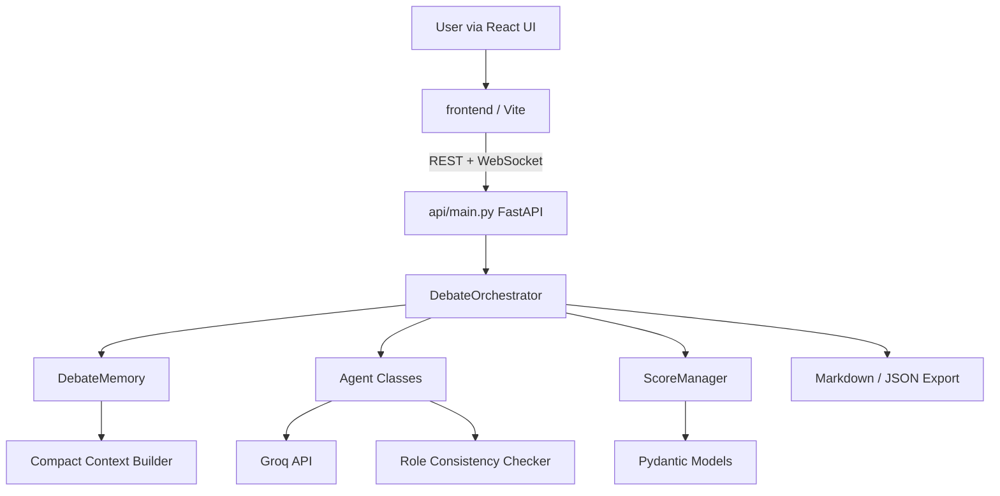

# ArgueBot: Multi-Agent Debate System

A four-agent autonomous debate system built for live university presentations. ArgueBot accepts any user-supplied debate motion, runs structured multi-round debates, scores both sides in real time, and delivers a final verdict.

## Overview

ArgueBot orchestrates four distinct AI agents:

| Agent | Role |
|-------|------|
| **Proponent** | Argues in favor of the motion |
| **Opponent** | Argues against the motion |
| **Moderator** | Enforces format, manages turns, remains neutral |
| **Scoring Judge** | Evaluates argument quality and delivers verdicts |

Unlike free-form multi-agent chat, ArgueBot uses a **central orchestrator** with deterministic turn ordering, separate system prompts, compact context management, and programmatic score validation.

## Architecture



## Features

- Autonomous 6–10 round structured debates
- Four distinct agent personas with role-consistency enforcement
- Live scorecard with cumulative tracking and charts
- Weighted 100-point scoring rubric with programmatic validation
- Automatic retry on severe persona collapse
- Failure analysis with violation logging
- Demo Mode with prerecorded sample debate (no API key required)
- Export transcript (Markdown) and full debate record (JSON)
- Optional stress-test mode for role-consistency validation

## Setup

### Prerequisites

- Python 3.11+
- Node.js 18+ (for React UI)
- Groq API key (optional if using Demo Mode)

### Installation

Install [uv](https://docs.astral.sh/uv/) if you don't have it:

```bash
curl -LsSf https://astral.sh/uv/install.sh | sh
```

Then install backend dependencies:

```bash
uv sync
```

Copy `.env.example` to `.env` and configure your Groq credentials:

```bash
cp .env.example .env
```

#### Obtaining a Groq API Key

1. Create a free account at [console.groq.com](https://console.groq.com).
2. Go to **API Keys** in the left sidebar.
3. Click **Create API Key**, give it a name, and copy the key immediately (it is shown only once).
4. Paste the key into your `.env` file as `GROQ_API_KEY`.

Edit `.env`:
```
GROQ_API_KEY=your_key_here
GROQ_MODEL=llama-3.3-70b-versatile
```

`GROQ_MODEL` defaults to `llama-3.3-70b-versatile` if omitted. See the [Groq model list](https://console.groq.com/docs/models) for other options.

## How to Run

### React UI (recommended)

Run the API and frontend in two terminals:

**Terminal 1 — API backend:**
```bash
uv run uvicorn api.main:app --reload --port 8000
```

**Terminal 2 — React frontend:**
```bash
cd frontend
npm install
npm run dev
```

Open **http://localhost:5173** in your browser.

The Vite dev server proxies `/api` and `/ws` requests to the FastAPI backend on port 8000.

**Production build (single server):**
```bash
cd frontend && npm install && npm run build
uv run uvicorn api.main:app --port 8000
```
Then open **http://localhost:8000** — FastAPI serves the built React app.

### Streamlit UI (legacy)

```bash
uv run streamlit run app.py
```

Open the URL shown in the terminal (typically `http://localhost:8501`).

### Demo Mode

If no API key is configured, enable **Demo Mode** in the sidebar to load the prerecorded sample debate. Demo Mode is clearly labeled as simulated data.

## How to Run Tests

```bash
uv run pytest -q
```

All tests run without a live API connection.

## Debate Flow

| Round | Name | Participants |
|-------|------|-------------|
| 0 | Introduction | Moderator |
| 1 | Opening Statements | Proponent → Opponent → Judge |
| 2 | Evidence and Main Case | Proponent → Opponent → Judge |
| 3 | Rebuttals | Proponent → Opponent → Judge |
| 4 | Cross-Examination | Moderator → Proponent → Opponent → Judge |
| 5 | Final Rebuttal | Proponent → Opponent → Judge |
| 6 | Closing & Verdict | Proponent → Opponent → Judge (final) |

If more than 6 rounds are selected, additional rebuttal or cross-examination rounds are inserted before closing.

## Prompt Engineering Strategy

1. **Fixed system prompts** — Each agent has a dedicated system prompt defining identity, objectives, forbidden behaviors, and required output format.
2. **Turn-specific reminders** — Every call includes an explicit role reminder reinforcing the agent's fixed position.
3. **Compact context** — `DebateMemory` provides round summaries, opponent's latest argument, and prior claims rather than the full raw transcript.
4. **Temperature tuning** — Debaters use 0.7, Moderator 0.2, Judge 0.1 to reduce evaluation drift.
5. **Structured judge output** — JSON mode with Pydantic validation for scoring checkpoints.

## Persona-Collapse Prevention

ArgueBot implements multiple layers of protection:

- Strong system prompts with forbidden behaviors
- Turn-specific role reminders on every call
- Programmatic pattern-based role checks
- One automatic retry with corrective instruction on severe violations
- Violation logging for failure analysis
- Optional stress-test mode injecting adversarial instructions

## Scoring Methodology

### Rubric (100 points total)

| Category | Weight |
|----------|--------|
| Logical Reasoning | 25% |
| Evidence and Support | 20% |
| Relevance and Responsiveness | 15% |
| Rebuttal Quality | 15% |
| Consistency and Role Adherence | 15% |
| Clarity and Organization | 10% |

Each category is scored 0–10. Weighted totals are **recalculated programmatically** — the system never trusts model arithmetic.

### Aggregation

Cumulative scores are the **arithmetic mean** of each side's weighted totals across all scored rounds. The final verdict uses these cumulative averages. Ties are permitted when scores differ by less than 2 points.

## Failure Modes

| Failure Mode | Description | Mitigation |
|-------------|-------------|------------|
| **Persona collapse** | Agent switches sides or adopts wrong role | Pattern checks + retry with corrective prompt |
| **Context contamination** | Prior messages bias agent off-role | Compact summaries instead of full transcript |
| **Prompt injection** | Adversarial instructions in conversation history | System prompts resist; stress-test validates |
| **Judge bias** | Judge favors one position ideologically | Low temperature, structured rubric, programmatic scoring |
| **Verbosity bias** | Longer responses score higher | Rubric explicitly penalizes unsupported verbosity |
| **Shared-model bias** | Same model for all agents creates correlated errors | Distinct prompts, temperatures, and role checks |
| **Hallucinated evidence** | Agents invent citations or statistics | Prompts forbid fabrication; judge penalizes unsupported claims |
| **LLM-as-judge limitations** | Judge cannot verify facts or detect all errors | Limitations reported in final verdict |

## Ethical and Practical Implications

- AI debates demonstrate argument structure, not ground truth
- Scores reflect argument quality, not factual correctness
- The system should not be used for high-stakes decisions without human oversight
- Demo Mode prevents misleading audiences when no API is available

## Known Limitations

- Requires Groq API access for live debates (free tier available; rate limits apply)
- Role checks use pattern matching and may miss subtle violations
- Judge cannot verify factual claims made during debate
- Single-model architecture means all agents share similar biases
- Long debates consume significant API tokens

## Future Improvements

- Multi-model architecture (different models per agent)
- LLM-based role validation as secondary check
- Human-in-the-loop judge override
- Debate replay and comparison mode
- Custom rubric configuration via UI

## Live Presentation Guide

1. **Before the session:** Test Demo Mode as a fallback. Verify API key and model in `.env`. Start both API and React dev servers.
2. **Opening:** Explain the four-agent architecture and central orchestrator design.
3. **Audience topic:** Enter a motion suggested by the audience (minimum 10 characters).
4. **During debate:** Enable **Presentation Mode** to hide the sidebar. Point out the status bar, round stepper, live scorecard, and agent cards.
5. **After verdict:** Walk through decisive factors, limitations, and failure analysis.
6. **Stress test:** Only enable if time permits — demonstrate persona-collapse resistance.
7. **Export:** Download transcript and JSON for audience follow-up.

## Project Structure

```
arguebot/
├── app.py                  # Streamlit UI (legacy)
├── api/
│   ├── main.py             # FastAPI REST + WebSocket
│   └── debate_manager.py   # Session management
├── frontend/               # React + Vite UI
│   ├── src/
│   │   ├── App.tsx
│   │   ├── components/     # Sidebar, StatusBar, Transcript, etc.
│   │   ├── hooks/          # useDebate WebSocket hook
│   │   └── api/            # API client
│   └── package.json
├── README.md
├── requirements.txt
├── pyproject.toml
├── uv.lock
├── .env.example
├── .gitignore
├── src/
│   ├── config.py           # Environment configuration
│   ├── models.py           # Pydantic data models
│   ├── prompts.py          # System prompts and builders
│   ├── agents.py           # Agent classes and role checks
│   ├── orchestrator.py     # Central debate orchestrator
│   ├── scoring.py          # Score calculation and aggregation
│   ├── memory.py           # Context and memory management
│   └── utils.py            # Groq client wrapper and exports
├── tests/
│   ├── test_scoring.py
│   ├── test_role_consistency.py
│   └── test_orchestrator.py
└── examples/
    └── sample_debate.json
```

## License

Educational project for university presentation purposes.
